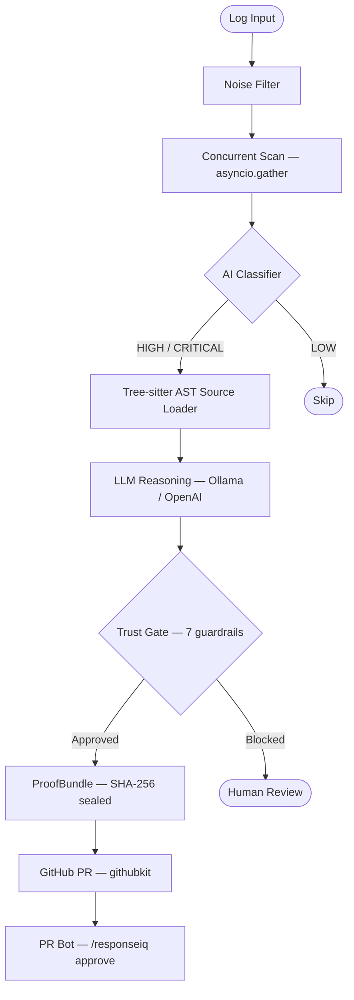

# ResponseIQ

[](https://github.com/infoyouth/responseiq/actions)
[](https://github.com/infoyouth/responseiq/releases)
[](https://pypi.org/project/responseiq/)
[](LICENSE)
[](https://codecov.io/gh/infoyouth/responseiq)
[](https://pypi.org/project/responseiq/)
[](reports/swe_bench_eval.md)
[](https://scorecard.dev/viewer/?uri=github.com/infoyouth/responseiq)
[](https://mypy-lang.org/)
[](https://github.com/astral-sh/ruff)

> **Your 3am alert fixed itself and opened a PR before you woke up.**

ResponseIQ is a **self-healing infrastructure copilot**. It reads your crash logs, loads the actual source code from your repositories using Tree-sitter AST parsing, and generates surgical fixes — complete with a rollback script, a Trust Gate audit trail, and a GitHub PR — all without requiring human intervention at 3am.

**Zero config. Try it now:**

```bash
pip install responseiq && responseiq demo
```

[](https://gitpod.io/#https://github.com/infoyouth/responseiq)

---

## How it works

```bash
# Pipe Kubernetes logs straight in — no plugin, no config
kubectl logs payment-svc --since=1h | responseiq --mode fix --target - --explain

# Or Docker
docker logs --tail 200 my-api | responseiq --mode fix --target - --explain
```

ResponseIQ will:
1. **Filter** out noise lines automatically
2. **Resolve** container paths like `/app/services/auth.py` to the real source files in your repos
3. **Load** the actual crashing functions via Tree-sitter AST into the AI context
4. **Generate a fix** with a full explanation of why it chose that approach
5. **Run it through 7 safety guardrails** before doing anything
6. **Open a GitHub PR** (or print the patch in dry-run mode if no token is set)
7. **Write a `REASONING.md`** audit log you can paste straight into your post-mortem

---

## What makes it different

Most log analysis tools pattern-match on error strings. ResponseIQ does something different: **it reads your code**.

When your auth service crashes at `/app/services/auth_service.py:120`, ResponseIQ resolves that container path to the actual file, loads the function with its surrounding context via Tree-sitter, and gives the AI exactly what it needs to understand the bug — not just the error message. That is why it generates a *fix*, not just a description.

---

## Benchmark

Evaluated against **SWE-bench Verified** — the same dataset used to rank SWE-agent, Devin, and OpenHands.

| Model | Samples | Pass@1 | Latency p50 | API key needed |
|---|---|---|---|---|
| llama3.2 (local Ollama) | 20 | **20%** | 29s | No |

1-in-5 incidents get a correct, Trust-Gate-approved patch in ~30 seconds using a free local model. See [reports/swe_bench_eval.md](reports/swe_bench_eval.md) for the per-repo breakdown.

---

## Architecture



---

## Features

### Core pipeline

| What | How |
|---|---|
| **Reads your actual source code** | Tree-sitter AST loads the exact crashing functions, not just file paths |
| **Multi-repo path resolution** | Maps container paths like `/app/services/auth.py` to your real source — local or remote |
| **Trust Gate — 7 guardrails** | No bare except, no secrets, syntax valid, blast radius assessed, and more — every patch must pass all 7 |
| **SHA-256 proof chain** | Every decision is sealed into a `ProofBundle` — SOC2-ready audit trail |
| **GitHub PR bot** | Opens a draft PR and responds to `/responseiq approve`, `/responseiq reject`, `/responseiq explain` |
| **Rollback script** | Generates an executable `rollback_<id>.py` alongside every patch |
| **Works without any API key** | Full rule-engine fallback is always available |

### New in v2.24 — Modern AI stack

| Feature | What it does |
|---|---|
| **`--mode watch` daemon** | Continuous async tail of any log file; bursts are debounced and sent for AI analysis automatically |
| **SSE streaming endpoint** | `POST /api/v1/incidents/analyze/stream` emits live events (`started → scrubbing → analyzing → critic → trust_gate → complete`) so UIs update in real time |
| **Critic / reviewer agent** | A second fast-model pass reviews every proposed fix for logic errors and hidden regressions before the Trust Gate runs |
| **LiteLLM multi-provider** | Set `RESPONSEIQ_USE_LITELLM=true` to route calls through LiteLLM — supports 100+ providers with a single env-var switch |
| **OTel GenAI conventions** | All LLM calls emit `gen_ai.*` OpenTelemetry spans — plug any OTLP-compatible backend for cost and latency tracking |
| **DSPy prompt optimiser** | Scaffold for automatic prompt optimisation via DSPy; activate with `responseiq[dspy]` + `RESPONSEIQ_DSPY_ENABLED=true` |
| **MCP server** | `responseiq-mcp` exposes four tools (`analyze_incident`, `get_remediation`, `run_trust_gate`, `open_pr`) via the Model Context Protocol for agent integrations |

### Language-specific parsers

Dedicated parsers extract rich structured context — goroutine IDs, stack frames, exception chains, and framework signals — before the AI even sees the log.

| Language / Framework | What it extracts |
|---|---|
| **Go** | `panic` message, goroutine states, stack frames with file + line, signal crashes (SIGSEGV, SIGABRT) |
| **Node.js** | `TypeError`/`ReferenceError`, V8 stack frames with column numbers, unhandled promise rejections |
| **Spring Boot** | Exception chain, root cause, Log4j/Logback lines with thread and logger |
| **Django** | Exception type, traceback frames, request path |
| **FastAPI** | Uvicorn/Starlette exception context |
| **Python (built-in)** | All Python tracebacks via `KeywordParser` |

### Infrastructure features

| Feature | What it does |
|---|---|
| **Post-apply watchdog** | After applying a patch, monitors your error-rate metric (Datadog, Prometheus, or `/health` probe). Automatically executes the rollback script if the rate spikes above the configured threshold. |
| **K8s YAML patcher** | Edits Kubernetes Deployment manifests using `ruamel.yaml` — comments, quotes, and indentation survive the diff. |
| **Stateful conversations** | Each incident gets a persistent multi-turn AI session. Redis-backed in production; transparent in-memory fallback in dev/test. |
| **PII scrubbing** | Regex email redaction is always on. Set `RESPONSEIQ_NER_SCRUB=true` and install spaCy to add NER-level PERSON/ORG/location scrubbing. |

---

## Quick start

### CLI — local dev or CI

```bash
# 1. Install
pip install responseiq

# 2. Configure — 3 questions, writes .env, done
responseiq init

# 3. Scan
responseiq --mode scan --target ./logs/error.log

# 4. Fix with full explanation
responseiq --mode fix --target ./logs/error.log --explain

# 5. Shadow mode — read-only triage, nothing is changed
responseiq --mode shadow --target ./logs/ --shadow-report

# 6. Watch mode — continuous tail daemon (new in v2.24)
responseiq --mode watch --target ./logs/app.log
```

**No LLM key?** The rule-engine fallback activates automatically. `responseiq init` is optional.

**LLM options:**

```bash
# Local Ollama (free, no data leaves your machine — recommended)
LLM_BASE_URL=http://localhost:11434/v1 LLM_ANALYSIS_MODEL=llama3.2 responseiq --mode scan --target ./logs/

# OpenAI
OPENAI_API_KEY=sk-... responseiq --mode scan --target ./logs/
```

**Pipe from anywhere:**

```bash
kubectl logs -l app=api --since=1h        | responseiq --mode fix  --target - --explain
docker logs --tail 200 my-container       | responseiq --mode scan --target -
cat ./logs/app.log                        | responseiq --mode scan --target -

# Structured JSON / NDJSON
echo '{"level":"ERROR","message":"KeyError: email","service":"api"}' \
  | responseiq --mode scan --target -
```

### Self-hosted API server

```bash
# Start server + Postgres
docker-compose up -d
curl http://localhost:8000/health

# Local dev with hot-reload
uv sync
uv run uvicorn responseiq.app:app --reload
```

Point your existing alert tools at `POST /api/v1/incidents/ingest`:

| Platform | Integration |
|---|---|
| **Datadog** | Webhook → `POST /api/v1/incidents/ingest` |
| **PagerDuty** | Event Orchestration webhook |
| **Sentry** | Internal Integrations → Webhook URL |
| **Alertmanager** | Webhook receiver in `alertmanager.yml` |
| **GitHub Actions** | `curl` step in your workflow |

**SSE streaming** — get live progress events while an incident is being analysed:

```bash
curl -N -X POST http://localhost:8000/api/v1/incidents/analyze/stream \
  -H 'Content-Type: application/json' \
  -d '{"log_text": "ERROR: NullPointerException at UserService.java:42"}'
# event: started
# event: scrubbing
# event: analyzing
# event: critic
# event: trust_gate
# event: complete
```

**MCP server** — expose ResponseIQ as an AI agent tool:

```bash
pip install 'responseiq[mcp]'
responseiq-mcp          # starts stdio MCP server
# Tools: analyze_incident · get_remediation · run_trust_gate · open_pr
```

### Try the built-in demo

```bash
git clone https://github.com/infoyouth/responseiq.git && cd responseiq
pip install responseiq

responseiq --mode scan   --target ./samples/crash.log
responseiq --mode fix    --target ./samples/crash.log --explain
responseiq --mode shadow --target ./samples/ --shadow-report
```

`samples/` contains three real injected bugs with a pre-recorded crash log. No API key, no database, nothing to set up.

**Expected scan output:**

```
------------------------------------------------------------
  ResponseIQ Scan Report
  Target : samples/crash.log
  Status : SUCCESS
------------------------------------------------------------
  Scanned  : 3 message(s)
  Incidents: 3 found
------------------------------------------------------------
  1. [HIGH]     KeyError: 'email' in process_user_request
  2. [CRITICAL] Memory leak — _request_log unbounded growth
  3. [HIGH]     ZeroDivisionError: division by zero (reset race)
------------------------------------------------------------
  Tip: run with --mode fix to apply safe remediations.
------------------------------------------------------------
```

---

## SWE-bench

```bash
# Smoke run — 5 samples, no LLM key
uv run python scripts/swe_bench_eval.py --samples 5 --dry-run

# Full run (500 samples)
uv run python scripts/swe_bench_eval.py --samples 500

# Filter by repo
uv run python scripts/swe_bench_eval.py --repo sympy/sympy --samples 50
```

Outputs `reports/swe_bench_eval.md` and `reports/predictions.jsonl` (compatible with the official `swebench` Docker harness).

---

## Development

```bash
uv sync
make lint    # ruff format --check + ruff check + mypy
make test    # pytest -n auto --dist=loadscope
make all     # lint + type-check + test + build + security audit
```

### Project layout

```
src/responseiq/
  cli.py                        # CLI entry point (--mode scan|fix|shadow|watch)
  app.py                        # FastAPI server (webhooks + SSE streaming)
  mcp_server.py                 # MCP server — 4 agent tools (responseiq-mcp)
  ai/
    llm_service.py              # LLM calls with OTel GenAI spans + LiteLLM support
    dspy_optimizer.py           # DSPy prompt optimisation scaffold (opt-in)
  services/
    remediation_service.py      # Core LLM reasoning brain
    critic_service.py           # Second-pass critic/reviewer agent
    github_pr_service.py        # GitHub PR bot (githubkit)
    watchdog_service.py         # Post-apply error-rate monitor + auto-rollback
    conversation_service.py     # Stateful AI conversations (Redis + in-memory fallback)
  routers/
    streaming.py                # SSE streaming endpoint
  plugins/
    scan.py / fix.py / shadow.py / watch.py
    go_parser.py / nodejs_parser.py / spring_parser.py / django_parser.py / fastapi_parser.py
  utils/
    context_extractor.py        # Tree-sitter AST source loader
    multi_repo_resolver.py      # Maps container paths to local source files
    k8s_patcher.py              # Kubernetes YAML patcher (comment-preserving)
    log_scrubber.py             # PII redaction (email regex + optional spaCy NER)
```

---

## Disclaimer

ResponseIQ uses generative AI to suggest infrastructure and code fixes. AI can hallucinate — syntactically correct but functionally wrong patches are possible. **Review every PR or patch before merging.** The Trust Gate reduces risk but is not a substitute for human review. See the [MIT License](LICENSE) — no warranty implied.

For security issues see [docs/SECURITY.md](docs/SECURITY.md).
