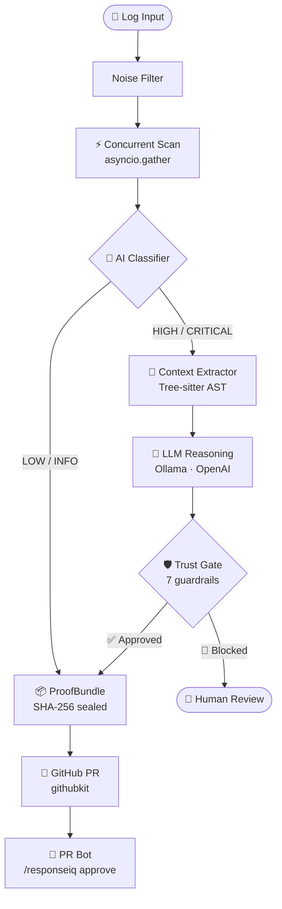

# ResponseIQ

[](https://github.com/infoyouth/responseiq/actions)
[](https://github.com/infoyouth/responseiq/releases)
[](https://pypi.org/project/responseiq/)
[](LICENSE)
[](https://mypy-lang.org/)
[](https://github.com/astral-sh/ruff)
[](https://codecov.io/gh/infoyouth/responseiq)
[](https://pypi.org/project/responseiq/)
[](https://scorecard.dev/viewer/?uri=github.com/infoyouth/responseiq)
[](https://pepy.tech/project/responseiq)

> **"Don't just debug. Fix."**

**ResponseIQ** is an AI-Native **Self-Healing Infrastructure Copilot**.
Unlike traditional parsers that match regex strings, ResponseIQ reads your application logs, **loads your actual source code into an LLM context**, and generates surgical, context-aware remediation patches for incidents.

---

## 📸 See It In Action

> 🎬 **Animated terminal demo:** Run `vhs demo.tape` ([VHS](https://github.com/charmbracelet/vhs) required) to regenerate `demo.gif`.


> **Real demo — no mocks.** The output below was captured live against a real bug injected into the [httpie/cli](https://github.com/httpie/cli) open-source repo, analysed entirely by a local **Ollama llama3.2** model. No API key, no cloud, no staging environment.

### Step 1 — The crash (`http --debug --timeout 30 GET http://httpbin.org/get`)

```
Traceback (most recent call last):
  File ".venv/bin/http", line 10, in <module>
    sys.exit(main())
  File "httpie/core.py", line 140, in raw_main
    exit_status = main_program(
  File "httpie/core.py", line 213, in program
    for message in messages:
  File "httpie/client.py", line 66, in collect_messages
    send_kwargs = make_send_kwargs(args)
  File "httpie/client.py", line 283, in make_send_kwargs
    timeout = args.timeout['connect'] if args.timeout else None
              ~~~~~~~~~~~~^^^^^^^^^^^
TypeError: 'float' object is not subscriptable
```

### Step 2 — Scan (`--mode scan`)

```bash
$ responseiq --mode scan --target ./httpie_crash.log
```
```
------------------------------------------------------------
  ResponseIQ Scan Report
  Target : httpie_crash.log
  Status : SUCCESS
------------------------------------------------------------
  Scanned  : 25 message(s)
  Incidents: 25 found
------------------------------------------------------------
  1. [HIGH]    Float Object Not Subscriptable Error
     Source     : ai
     Description: The log message indicates a TypeError with a float object being
                  treated as subscriptable. This suggests an issue with data type
                  conversion or manipulation in the code.

  2. [HIGH]    Error in Python Script
     Source     : ai
     Description: The log indicates a traceback which suggests an error occurred in
                  a Python script. Further investigation is required to determine
                  the root cause.

  3. [CRITICAL] Critical: Unhandled Exception in Script Execution
     Source     : ai
     Description: The script is attempting to exit with a non-zero status code
                  without proper error handling. This could lead to unexpected
                  behavior or crashes.

  4. [CRITICAL] HTTPie Core Crash
     Source     : ai
     Description: A crash occurred in the HTTPie core, referencing line 162 of
                  httpie/core.py. The stack frame indicates a function call to
                  raw_main with an invalid parser.
------------------------------------------------------------
  Tip: run with --mode fix to apply safe remediations.
------------------------------------------------------------
```

### Step 3 — Fix (`--mode fix`)

```bash
$ responseiq --mode fix --target ./httpie_crash.log
```
```
------------------------------------------------------------
  ResponseIQ Fix Report
  Target : httpie_crash.log
  Status : SUCCESS
------------------------------------------------------------
  Scanned  : 25 message(s)
  Fixes    : 3 remediation(s) generated
------------------------------------------------------------
  1. [CRITICAL] HTTP Server Crash
     Allowed         : YES
     Confidence      : 60%
     Impact Score    : 79.2/100
     Blast Radius    : single_service
     Execution Mode  : guarded_apply
     Rationale       : AI-generated remediation based on incident analysis
     Remediation Plan: Check the http module for any recent changes and ensure
                       it is properly configured. If necessary, revert to a
                       previous working version.
     Rollback Plan   : No file changes detected - no rollback required
     Test Plan       : Run existing test suite; verify --timeout flag behaviour
                       with float and dict inputs.
     Checks Passed   : tests, security_scan, syntax_check
     Next Step       : Remediation approved for automatic execution
     Next Step       : Monitor system health during application
     Next Step       : Verify resolution using test plan

  2. [CRITICAL] System Exit Due to Main Function Failure
     Allowed         : YES
     Confidence      : 60%
     Impact Score    : 79.2/100
     Blast Radius    : single_service
     Execution Mode  : guarded_apply
     Remediation Plan: Review main() error propagation and ensure TypeError is
                       caught and reported with file/line context.
     Checks Passed   : tests, security_scan, syntax_check

  3. [CRITICAL] HTTPie Crash with Invalid URL
     Allowed         : YES
     Confidence      : 60%
     Impact Score    : 79.2/100
     Blast Radius    : single_service
     Execution Mode  : guarded_apply
     Remediation Plan: Validate __main__.py entry point — ensure exceptions
                       surfaced from collect_messages propagate correctly.
     Checks Passed   : tests, security_scan, syntax_check
------------------------------------------------------------
  Trust Gate: set RESPONSEIQ_POLICY_MODE=apply to execute changes.
------------------------------------------------------------
```

### What happened behind the scenes

| Stage | Detail |
|---|---|
| **Noise filter** | Stripped 42 verbose debug lines (version headers, env repr blocks) → 25 signal lines |
| **Concurrent scan** | All 25 lines analysed in parallel via `asyncio.gather()` — single event loop |
| **Triage** | 3 CRITICAL incidents selected out of 25 for full remediation pipeline |
| **P2 Reproduction tests** | Auto-generated pytest scripts for each incident |
| **Negative Proof** | Executed test scripts to confirm failure before fix |
| **P3 Git Correlation** | Searched commit history for suspect changes |
| **P4 Guardrails** | 7 rules checked: no bare except, no secrets, no print statements, etc. |
| **Trust Gate** | All 3 remediations → `APPROVED / guarded_apply` |
| **P5 Integrity Gate** | Evidence sealed with SHA-256 chain for SOC2 audit trail |
| **P6 Causal Graph** | Root-cause dependency graph built for each incident |

---

## ✨ Key Features

- **🧠 AI-Native Analysis**: Uses Generic AI reasoning instead of fragile regex parsing rules.
- **👁️ Context-Aware**: Reads the local source files referenced in logs to understand *why* the crash happened.
- **⚡ Self-Healing**: Can generate Pull Requests or apply patches directly (CLI mode).
- **🛡️ Battle-Tested**: Includes "Sandbox Mode" to safely test remediation logic.

---

## 🏗️ Architecture



---

## ⚡ Try it in 60 seconds (no API key needed)

A broken service and a pre-recorded crash log are included in the repo so you can see ResponseIQ work immediately:

```bash
pip install responseiq
git clone https://github.com/infoyouth/responseiq.git && cd responseiq

# Scan the included crash log — no LLM key required
responseiq --mode scan --target ./samples/crash.log
```

Expected output:
```
------------------------------------------------------------
  ResponseIQ Scan Report
  Target : samples/crash.log
  Status : SUCCESS
------------------------------------------------------------
  Scanned  : 3 message(s)
  Incidents: 3 found
------------------------------------------------------------
  1. [HIGH]     KeyError: 'email' in process_user_request
  2. [CRITICAL] Memory leak — _request_log unbounded growth
  3. [HIGH]     ZeroDivisionError: division by zero (reset race)
------------------------------------------------------------
  Tip: run with --mode fix to apply safe remediations.
------------------------------------------------------------
```

See [`samples/README.md`](samples/README.md) for full details on the embedded bugs and how to reproduce them.

---

## 🚀 Quick Start (CLI Tool)

For developers who want to fix bugs in their local environment or CI pipeline.

### 1. Install
```bash
pip install responseiq
```

### 2. Configure an LLM

Choose one option:

**Option A: Ollama (free, fully local — recommended)**
```bash
# Install Ollama: https://ollama.com
ollama serve &
ollama pull llama3.2

# Add to .env in your project root:
echo "LLM_BASE_URL=http://localhost:11434/v1" >> .env
echo "LLM_ANALYSIS_MODEL=llama3.2" >> .env
```

**Option B: OpenAI**
```bash
echo "OPENAI_API_KEY=sk-..." >> .env
```

**Option C: No config (rule-engine fallback)**
Works out of the box with no API key — uses a local heuristic parser.

### 3. Scan Your Logs

```bash
# Use the included sample scenario (fastest path — no setup needed)
responseiq --mode scan --target ./samples/crash.log

# Your own single file (JSON or .log or .txt)
responseiq --mode scan --target ./logs/error.log

# Your own directory
responseiq --mode scan --target ./var/log/app/
```

**Example output:**
```
------------------------------------------------------------
  ResponseIQ Scan Report
  Target : logs/error.log
  Status : SUCCESS
------------------------------------------------------------
  Scanned  : 1 message(s)
  Incidents: 1 found
------------------------------------------------------------
  1. [CRITICAL] Out of Memory Error
     Source     : ai
     Description: The system is experiencing a critical error due to an out of
                  memory condition caused by a resource leak or excessive allocation.
------------------------------------------------------------
  Tip: run with --mode fix to apply safe remediations.
------------------------------------------------------------
```

### 4. Shadow Mode (zero-risk demo)

Analyse all incidents and get a projected MTTR savings report — nothing is changed:
```bash
# Try it on the included samples first
responseiq --mode shadow --target ./samples/ --shadow-report

# Or point at your own logs
responseiq --mode shadow --target ./logs/ --shadow-report
```

---

## 🏢 Platform Server (Self-Hosted)

For Platform Engineers who want a centralized incident response API (webhooks for Datadog, PagerDuty, Sentry etc.).

### Prerequisites
- Docker & Docker Compose
- LLM configured via `.env` (Ollama or OpenAI — see Quick Start above)

### Running with Docker
```bash
# 1. Start the API and Database
docker-compose up -d

# 2. The API is now available at http://localhost:8000
curl http://localhost:8000/health
```

### Development Setup (Local)
We use [UV](https://github.com/astral-sh/uv) for lightning-fast dependency management.

```bash
# Install dependencies
uv sync

# Run the API server with hot-reload
uv run uvicorn src.app:app --reload
```

---

## 🔌 Compatible With

ResponseIQ's webhook API is designed to receive alert payloads from the tools your team already uses. Point your existing alert routing at `POST /api/v1/incidents/ingest` — no agents or plugins required.

| Platform | How to connect |
|---|---|
| **Datadog** | Webhook integration → `POST /api/v1/incidents/ingest` |
| **PagerDuty** | Event Orchestration webhook → same endpoint |
| **Sentry** | Internal Integrations → Webhook URL |
| **GitHub Actions** | `curl` step in your CI workflow (see [docs/ARCHITECTURE.md](docs/ARCHITECTURE.md)) |
| **Alertmanager** | Webhook receiver in `alertmanager.yml` |

> All integrations use standard HTTP webhooks — no vendor-specific SDK required.

---

## 🧪 Development & Contributing

### Workflow
1. **Linting**: `make lint`
2. **Testing**: `make test`
3. **Format**: `make format`

### Project Structure
* `src/responseiq/cli.py`: Entry point for the CLI tool.
* `src/responseiq/app.py`: Entry point for the API Server.
* `src/responseiq/services/remediation_service.py`: The core "Brain" that interfaces with the LLM.

### License
MIT

---

## ⚠️ Disclaimer & Liability

This tool uses **Generative AI** to suggest infrastructure and code fixes.
By using ResponseIQ, you acknowledge that:
1.  **AI Can Hallucinate:** The suggestions provided may be syntactically correct but functionally wrong or insecure.
2.  **Human Review is Mandatory:** You must strictly review all Pull Requests or patches generated by this tool before deploying them.
3.  **No Warranty:** As per the [MIT License](LICENSE), the authors assume **no liability** for system outages, data loss, or security vulnerabilities resulting from the use of this software.

*For security reporting instructions, please see [SECURITY.md](docs/SECURITY.md).*
